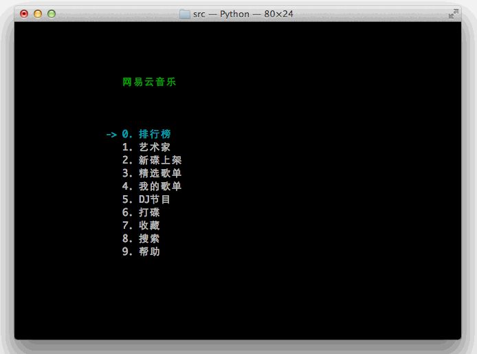

# NetEase-MusicBox

[](LICENSE)
[](https://pypi.org/project/NetEase-MusicBox/)
[](https://pypi.org/project/NetEase-MusicBox/)

高品质网易云音乐命令行客户端，基于 Python 编写。

感谢为 MusicBox 的开发付出过努力的[每一个人](https://github.com/darknessomi/musicbox/graphs/contributors)。

网易云音乐 API 能力由 [NeteaseCloudMusicApiEnhanced/api-enhanced](https://github.com/neteasecloudmusicapienhanced/api-enhanced) 提供支持。

## Demo

[](https://pypi.org/project/NetEase-MusicBox/)

## 功能特性

- 支持 320kbps 高品质音乐播放
- 支持歌曲、艺术家、专辑、本地列表模糊搜索
- 支持排行榜、新碟推荐、精选歌单、主播电台、私人歌单和每日推荐
- 支持本地收藏、歌曲评论、专辑跳转、随心打碟和定时退出
- 支持播放进度、播放模式、当前播放、历史播放和桌面歌词显示
- 支持 Vim 风格快捷键、数字快捷键和自定义全局快捷键

## 安装

`musicbox` 是命令行应用。普通用户建议用 [uv](https://docs.astral.sh/uv/) 或 [pipx](https://pipx.pypa.io/) 安装为全局命令；Poetry 只用于本仓库开发调试，不会提供全局 `musicbox` 命令。

### 环境要求

- Python 3.10 及以上
- `mpg123`，用于播放歌曲

`rapidfuzz` 和 `qrcode` 会随 MusicBox 自动安装，分别用于模糊搜索和扫码登录二维码生成。

### 安装系统依赖

macOS:

```bash
brew install mpg123 uv
```

Ubuntu/Debian:

```bash
sudo apt-get install mpg123
```

CentOS/Red Hat:

```bash
sudo yum install -y python3-devel mpg123
```

### 安装 MusicBox

从源码安装最新代码：

```bash
git clone https://github.com/darknessomi/musicbox.git
cd musicbox
uv tool install .
```

也可以使用 `pipx install .`。如果希望源码改动实时生效，使用 `uv tool install -e .`。

从 PyPI 安装：

```bash
uv tool install netease-musicbox
# 或
pipx install NetEase-MusicBox
```

PyPI 版本可能落后于源码。

### 开发调试

```bash
git clone https://github.com/darknessomi/musicbox.git
cd musicbox
poetry env use python3.12
poetry install
poetry run musicbox
```

### 可选依赖

- `aria2`：缓存歌曲
- `libnotify-bin`：Linux 消息提示
- `qtpy python-dbus dbus qt`：桌面歌词。根据系统 Qt 版本，可能还需要安装 `pyqt4`、`pyside` 或 `pyside2`

## 使用

启动 MusicBox：

```bash
musicbox
```

进入需要登录的功能时，终端会显示二维码。登录方式仅支持扫码登录，已不再支持账号密码登录。

1. 用网易云音乐手机 App 扫描二维码，并在手机上确认。
2. 登录成功后 Cookie 会保存到 `~/.local/share/netease-musicbox/cookie.txt`。
3. 未设置 `XDG_DATA_HOME` 时，Cookie 会保存到 `~/.config/netease-musicbox/cookie.txt`。

二维码会在终端中以字符块渲染。请保证终端窗口足够高，约 25 行以上，并使用等宽字体。若终端二维码无法扫描，可复制提示中的 `https://music.163.com/login?codekey=...` 链接，用其他工具生成二维码后再扫码。

## 快捷键

带 `num +` 的快捷键支持数字修饰，先输入数字，再输入被修饰的按键。

| 按键 | 功能 | 说明 |
| --- | --- | --- |
| `j` | Down | 下移 |
| `k` | Up | 上移 |
| `num + j` | Quick Jump | 快速向后跳转 n 首 |
| `num + k` | Quick Up | 快速向前跳转 n 首 |
| `h` | Back | 后退 |
| `l` | Forward | 前进 |
| `u` | Prev Page | 上一页 |
| `d` | Next Page | 下一页 |
| `f` | Search | 当前列表模糊搜索 |
| `[` | Prev Song | 上一曲 |
| `]` | Next Song | 下一曲 |
| `num + [` | Quick Prev Song | 快速前 n 首 |
| `num + ]` | Quick Next Song | 快速后 n 首 |
| `num + Shift + g` | Index for Song | 跳到第 n 首 |
| `=` | Volume + | 音量增加 |
| `-` | Volume - | 音量减少 |
| `Space` | Play/Pause | 播放/暂停 |
| `?` | Shuffle | 手气不错 |
| `m` | Menu | 主菜单 |
| `p` | Present/History | 当前/历史播放列表 |
| `i` | Music Info | 当前音乐信息 |
| `Shift + p` | Playing Mode | 播放模式切换 |
| `a` | Add | 添加曲目到打碟 |
| `Shift + a` | Enter Album | 进入专辑 |
| `g` | To the First | 跳至首项 |
| `Shift + g` | To the End | 跳至尾项 |
| `z` | DJ List | 打碟列表 |
| `s` | Star | 添加到收藏 |
| `c` | Collection | 收藏列表 |
| `r` | Remove | 删除当前条目 |
| `Shift + j` | Move Down | 向下移动当前项目 |
| `Shift + k` | Move Up | 向上移动当前项目 |
| `Shift + c` | Cache | 缓存歌曲到本地 |
| `,` | Like | 喜爱 |
| `.` | Trash FM | 删除 FM |
| `/` | Next FM | 下一 FM |
| `q` | Quit | 退出 |
| `t` | Timing Exit | 定时退出 |
| `w` | Quit & Clear | 退出并清除用户信息 |

## 配置

配置文件位于 `~/.config/netease-musicbox/config.json`，可配置缓存、快捷键、消息提示和桌面歌词。

由于歌曲 API 只接受中国大陆地区访问，非中国大陆地区用户需要自行设置代理。可用 polipo 将 socks5 代理转换成 http 代理：

```bash
export http_proxy=http://IP:PORT
export https_proxy=http://IP:PORT
curl -L ip.cn
```

确认显示 IP 属于中国大陆地区即可。

## 排错

- 某些歌曲不能播放且总时长为 `00:01` 时，通常是版权问题。
- 特定终端不能播放时，先检查同一终端下 `mpg123` 能否正常使用，再检查其他终端下 `musicbox` 能否正常使用。报告 issue 时请附上这些检查结果和终端报错。
- 可通过 `tail -f ~/.local/share/netease-musicbox/musicbox.log` 查看日志。
- `mpg123` 部分新版本可能会报找不到声音硬件的错误，已知 `1.25.6` 可正常使用。

### 已知问题

- [#374](https://github.com/darknessomi/musicbox/issues/374)：i3wm 下播放杂音或快进，常见于 Arch Linux，可尝试更改 `mpg123` 配置。
- [#405](https://github.com/darknessomi/musicbox/issues/405)：32 位 Python 下 Cookie 时间戳超出 32 位整数最大值，可尝试使用 64 位 Python，或拷贝 Cookie 文件到对应位置。
- [#347](https://github.com/darknessomi/musicbox/issues/347)：暂停数分钟后 `mpg123` 停止输出，导致切换到下一首歌。该问题来自 `mpg123`，暂时无解决方案。
- [#791](https://github.com/darknessomi/musicbox/issues/791)：版权问题，`master` 分支已修复。

## 其他安装方式

以下方式可能不是最新版本，仅作备选。

Fedora:

```bash
sudo dnf install musicbox
```

Arch Linux:

```bash
pacaur -S netease-musicbox-git
```

## 更新日志

详见 [CHANGELOG.md](CHANGELOG.md)。

## License

[MIT](LICENSE)
